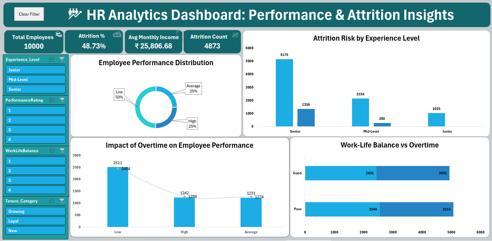

# HR Analytics Dashboard — Excel

An interactive HR analytics dashboard built with Microsoft Excel to analyze 10,000 employee records focusing on attrition, performance, and work-life balance.

**Tools:** Excel · Power Query · Power Pivot · DAX · PivotTables · VBA Macros

---

## Dashboard preview

---

## Key metrics

| Metric | Value |
|--------|-------|
| Total Employees | 10,000 |
| Attrition Rate | 48.73% |
| Avg Monthly Income | ₹25,807 |
| Attrition Count | 4,873 |

---

## Key insights

- Junior employees show the highest attrition risk across all experience levels
- 50% of employees fall in the Low performance category — training gap identified
- Overtime workers consistently show lower work-life balance scores
- High performers earn significantly higher monthly income — strong income-performance link

---

## Analysis covered

- Employee performance distribution (Low / Average / High)
- Attrition risk by experience level (Junior / Mid-Level / Senior)
- Impact of overtime on employee performance
- Work-life balance vs overtime correlation
- What-If analysis — attrition rate scenarios

---

## Files

| File | Description |
|------|-------------|
| `HR_Analytics_Project.xlsm` | Excel workbook with data, pivot tables, and dashboard |
| `dashboard.png` | Dashboard screenshot |
| `HR_Analytics_Project_Presentation.pptx` | Project presentation slides |

---

## Dataset

10,000 employee records — HR domain synthetic dataset
