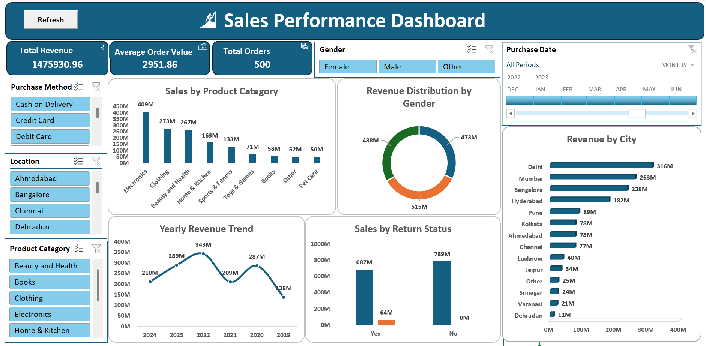

# Sales Performance Dashboard — Excel

An interactive sales dashboard built with Microsoft Excel to analyze 500 orders 
across product categories, cities, and customer demographics.

**Tools:** Excel · Pivot Tables · Pivot Charts · Slicers · Data Cleaning

---

## Dashboard preview

---

## Key insights

- Electronics led all categories with ₹4.09Cr revenue — 27.7% of total sales
- Delhi topped city-wise performance at ₹3.16Cr, followed by Mumbai (₹2.63Cr)
- 57% of total orders had no returns — indicating healthy product satisfaction
- Revenue peaked in 2022 at ₹3.43Cr and shows a declining trend through 2024

---

## Analysis covered

- Revenue breakdown by product category, city, and gender
- Yearly revenue trend (2019–2024)
- Purchase method distribution (Cash / Credit / Debit)
- Return status impact on revenue

---

## Files

| File | Description |
|------|-------------|
| `Sales_Performance_Dashboard.xlsx` | Main Excel file with raw data, pivot tables, and dashboard |
| `Dashboard_Screenshot.png` | Dashboard preview image |

---

## Dataset

500 sales records — sourced from [Kaggle / self-generated / mention your source here]

